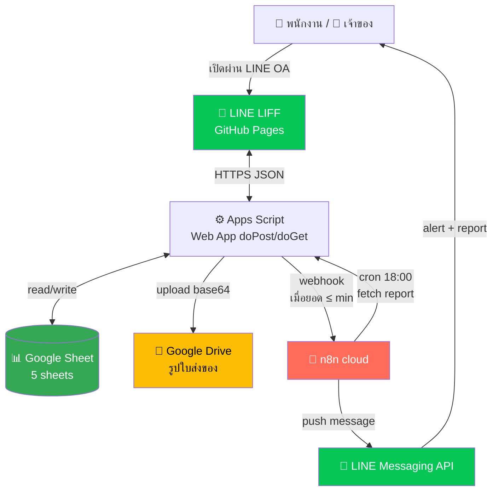
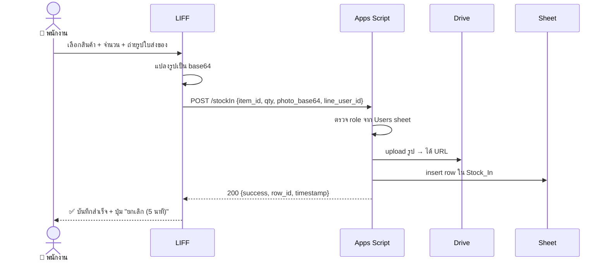
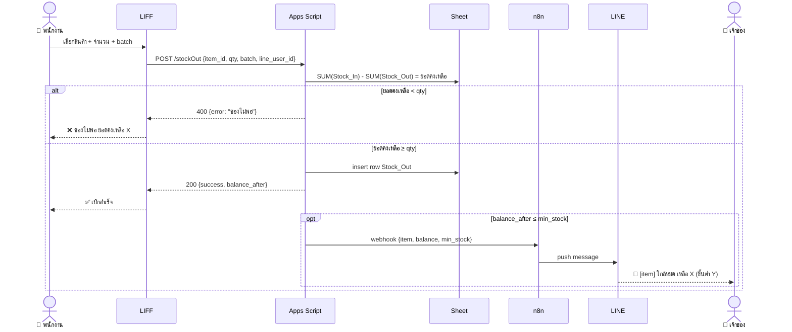
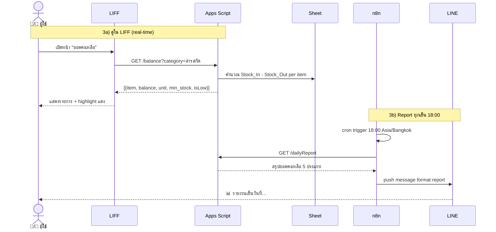
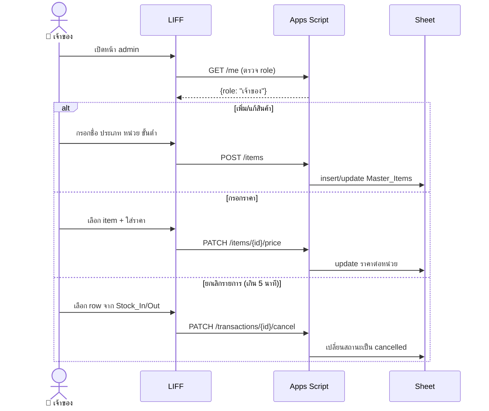

# Architecture — Factory Stock LIFF

> **Status:** Draft v1
> **สร้างเมื่อ:** 2026-05-09
> **อ่านก่อน:** [CONTEXT.md](CONTEXT.md)

---

## 1. ภาพรวมระบบ



**Legend:**
- 🟢 Google Sheet = Source of truth
- 🟡 Google Drive = file storage
- 🟧 n8n cloud = automation (alert + scheduled report)
- 🟩 LIFF + LINE = frontend + notification
- ⚙️ Apps Script = business logic ทั้งหมด

---

## 2. Component Responsibilities

| Component | หน้าที่ | ห้ามทำ |
|---|---|---|
| **LIFF (GitHub Pages)** | UI 4 หน้า: รับเข้า / เบิก / ยอดคงเหลือ / admin (เจ้าของ), ส่ง JSON ไป Apps Script, แปลงรูปเป็น base64 ก่อนส่ง | คำนวณยอดคงเหลือเอง, เก็บ state ถาวร |
| **Apps Script** | Validation, business logic ทั้งหมด, อ่าน/เขียน Sheet, upload รูปไป Drive, ตรวจ role จาก `Users`, trigger n8n เมื่อยอด ≤ min | UI rendering, ส่ง LINE message ตรง (ผ่าน n8n เท่านั้น) |
| **Google Sheet** | Source of truth ของทุก transaction | Logic / formula ซับซ้อน |
| **Google Drive** | เก็บไฟล์รูปใบส่งของในโฟลเดอร์เดียว | เก็บข้อมูล structured |
| **n8n cloud** | (1) รับ webhook จาก AS → ส่ง LINE alert, (2) cron 18:00 → fetch รายงานจาก AS → ส่ง LINE report | Business logic, validation |
| **LINE Messaging API** | Push message ทาง LINE OA | — |

---

## 3. Data Flow

### Flow 1 — รับเข้า (Stock In)



### Flow 2 — เบิกของ (Stock Out + Alert)



### Flow 3 — ดูยอดคงเหลือ + Report



### Flow 4 — Admin (เจ้าของเท่านั้น)



---

## 4. API Endpoints (Apps Script Web App)

| Method | Path | Body / Query | Auth | ใครเรียกได้ |
|---|---|---|---|---|
| GET | `/me` | — | line_user_id (header) | ทุกคน |
| GET | `/items` | `?category=สารสกัด` | line_user_id | ทุกคน |
| POST | `/items` | `{ชื่อ, ประเภท, หน่วย, ขั้นต่ำ}` | line_user_id | เจ้าของ |
| PATCH | `/items/:id/price` | `{ราคาต่อหน่วย}` | line_user_id | เจ้าของ |
| PATCH | `/items/:id/archive` | — | line_user_id | เจ้าของ |
| GET | `/balance` | `?category=` | line_user_id | ทุกคน |
| POST | `/stockIn` | `{item_id, จำนวน, photo_base64}` | line_user_id | ทุกคน |
| POST | `/stockOut` | `{item_id, จำนวน, batch}` | line_user_id | ทุกคน |
| PATCH | `/transactions/:id/cancel` | — | line_user_id | เจ้าของ row + ภายใน 5 นาที / เจ้าของ system |
| GET | `/dailyReport` | — | shared secret | n8n เท่านั้น |

> **หมายเหตุ:** Apps Script Web App ต้อง deploy เป็น "Anyone" + ตรวจ `line_user_id` ใน body/query เอง
> Endpoint `/dailyReport` ใช้ shared secret token แยก (เก็บใน Script Properties)

---

## 5. Sheet Structure

ดู [CONTEXT.md § 4 Data Model](CONTEXT.md#4-data-model)

**Index ที่ Apps Script ใช้บ่อย:**
- `Master_Items.item_id` → primary key
- `Stock_In.item_id` + `Stock_In.สถานะ=active` → SUM ตอนคำนวณยอด
- `Stock_Out.item_id` + `Stock_Out.สถานะ=active` → SUM ตอนคำนวณยอด
- `Users.line_user_id` → ตรวจ role ทุก request

---

## 6. Setup Plan (checklist ทำตามลำดับ)

### Phase A — Foundation (ทำก่อน)
- [ ] **A1:** สร้าง Google Sheet ตาม CONTEXT § 4 (5 sheets + header)
- [ ] **A2:** สร้าง Google Drive folder "factory-stock-photos" + จด folder ID
- [ ] **A3:** เพิ่ม row แรกใน `Users` (พี่ปุ้ย role=เจ้าของ + พนักงาน 1 คน)
- [ ] **A4:** เพิ่มสินค้า seed 5-10 รายการใน `Master_Items` ครอบคลุม 5 ประเภท

### Phase B — Apps Script Backend
- [ ] **B1:** Extensions → Apps Script จาก Sheet
- [ ] **B2:** ตั้ง Script Properties: `DRIVE_FOLDER_ID`, `N8N_WEBHOOK_URL`, `N8N_SECRET`
- [ ] **B3:** เขียน `Code.gs` — main `doGet` / `doPost` router
- [ ] **B4:** เขียน `auth.gs` — ตรวจ line_user_id + role
- [ ] **B5:** เขียน `items.gs` — CRUD Master_Items
- [ ] **B6:** เขียน `stock.gs` — stockIn / stockOut + คำนวณ balance
- [ ] **B7:** เขียน `report.gs` — dailyReport endpoint
- [ ] **B8:** เขียน `notify.gs` — เรียก n8n webhook เมื่อ ≤ min
- [ ] **B9:** Deploy as Web App → "Anyone" → จด URL

### Phase C — LINE LIFF Frontend
- [ ] **C1:** สร้าง GitHub repo `factory-stock-liff`
- [ ] **C2:** สร้าง LINE Login Channel + LIFF app ใน LINE Developers Console
- [ ] **C3:** เขียน `index.html` + 4 หน้า (รับเข้า / เบิก / ยอดคงเหลือ / admin)
- [ ] **C4:** ใส่ LIFF SDK + ดึง `liff.getProfile()` เอา line_user_id
- [ ] **C5:** Deploy GitHub Pages
- [ ] **C6:** ใส่ GitHub Pages URL ใน LIFF Endpoint URL
- [ ] **C7:** ผูก LIFF กับ LINE OA Rich Menu (ปุ่มเปิดแอป)

### Phase D — n8n Automation
- [ ] **D1:** สร้าง n8n cloud workflow #1: Alert
   - Webhook node → IF node → LINE Messaging API node
- [ ] **D2:** สร้าง n8n cloud workflow #2: Daily Report
   - Cron node (18:00 Asia/Bangkok) → HTTP Request → Format → LINE
- [ ] **D3:** ใส่ LINE Channel Access Token ใน n8n credentials

### Phase E — Test
- [ ] **E1:** ทดสอบ Flow 1 (รับเข้า + รูป)
- [ ] **E2:** ทดสอบ Flow 2 (เบิก + alert ยอดต่ำ)
- [ ] **E3:** ทดสอบ Flow 3a (ดูยอดใน LIFF) + 3b (report 18:00)
- [ ] **E4:** ทดสอบ Flow 4 (admin)
- [ ] **E5:** ทดสอบ edge cases ตาม § 7

---

## 7. Edge Cases

| # | สถานการณ์ | วิธีรับมือ | implement ที่ |
|---|---|---|---|
| 1 | เบิกเกินยอดคงเหลือ | block + return error "ของไม่พอ ยอดคงเหลือ X" | Apps Script `stock.gs` |
| 2 | ผู้ใช้ใหม่ที่ไม่อยู่ใน Users | block + ข้อความ "ยังไม่ได้ลงทะเบียน ติดต่อเจ้าของ" | Apps Script `auth.gs` |
| 3 | กรอกผิดเพิ่งกด submit (≤5 นาที) | LIFF แสดงปุ่ม "ยกเลิกรายการล่าสุด" → เปลี่ยนสถานะ | LIFF + `transactions.gs` |
| 4 | กรอกผิดเกิน 5 นาที | เจ้าของยกเลิกใน admin หน้า | Apps Script `transactions.gs` |
| 5 | Net หลุดตอน submit | LIFF แจ้ง error → ขอกรอกใหม่ (no offline cache) | LIFF |
| 6 | Apps Script timeout 6 นาที | Daily report อาจช้า → cache ผลลัพธ์ใน Sheet "Cache" + n8n GET | Apps Script `report.gs` |
| 7 | n8n cloud down ตอน webhook alert | log ลง Sheet `Logs` → เจ้าของเช็ค manual + retry | Apps Script `notify.gs` |
| 8 | สินค้า archive แล้วยังมีใน Stock_In/Out | ยังคำนวณ balance ได้ปกติ แต่ไม่ขึ้นใน dropdown ใหม่ | Apps Script `items.gs` |
| 9 | 2 คนเบิกพร้อมกัน | ไม่เกิด (มีพนักงานคนเดียว) — แต่ Apps Script ใช้ LockService ป้องกันไว้ | Apps Script `stock.gs` |
| 10 | รูปใหญ่เกิน 10 MB | LIFF resize ก่อนส่ง (max 1920px, jpeg quality 0.8) | LIFF |
| 11 | ราคายังไม่กรอก แล้ว report เรียกมูลค่า | แสดง "—" แทน 0 | Apps Script `report.gs` |
| 12 | Time zone เพี้ยน (UTC vs BKK) | บังคับ `Asia/Bangkok` ทุกที่ที่ใช้ Date | Apps Script + n8n |

---

## 8. Security & Secrets

- ❌ ห้ามใส่ Channel Access Token / Webhook URL ใน frontend
- ✅ Apps Script: `PropertiesService.getScriptProperties()`
   - `DRIVE_FOLDER_ID`
   - `N8N_WEBHOOK_URL`
   - `N8N_SECRET` (token ที่ n8n ส่งมาเวลาเรียก `/dailyReport`)
- ✅ n8n credentials: LINE Channel Access Token
- ✅ LIFF: ใช้ LIFF ID เปิดเผยได้ (ไม่ใช่ secret)
- ✅ ทุก endpoint ของ Apps Script ตรวจ `line_user_id` + role ก่อนทำงาน

---

## 9. Constraints / Limits ที่ต้องระวัง

| Resource | Limit | ผลกระทบ |
|---|---|---|
| Apps Script execution | 6 นาที/run | Daily report ของหลายร้อย item อาจช้า — ใช้ batch + cache |
| Apps Script triggers | 20 trigger/script | ใช้ trigger แค่ 1 (manual) เหลือเฟือ |
| Drive upload | 750 GB/วัน | ไม่มีปัญหา รูปวันละไม่กี่ MB |
| LINE push message | 500 ข้อความ/เดือน (free tier) | 1 alert + 1 report/วัน = 60/เดือน เหลือเฟือ |
| Sheet size | 10M cells | ไม่ถึง — Stock_In/Out รวมกันปีละ ~3000 row |
| n8n cloud free | 5,000 executions/เดือน | 30 cron + ~30 alert/เดือน เหลือเฟือ |

---

## 10. Folder Structure (GitHub repo)

```
factory-stock-liff/
├── README.md
├── CONTEXT.md              ← ของ section ที่ผ่านมา
├── docs/
│   └── architecture.md     ← ไฟล์นี้
│   └── TASKS.md            ← step ถัดไป
├── liff/                   ← deploy GitHub Pages
│   ├── index.html
│   ├── css/
│   ├── js/
│   │   ├── api.js          ← เรียก Apps Script
│   │   ├── auth.js         ← LIFF init + getProfile
│   │   ├── pages/
│   │   │   ├── stockIn.js
│   │   │   ├── stockOut.js
│   │   │   ├── balance.js
│   │   │   └── admin.js
│   │   └── utils.js
└── apps-script/            ← copy ไปวาง Apps Script editor
    ├── Code.gs             ← router doGet/doPost
    ├── auth.gs
    ├── items.gs
    ├── stock.gs
    ├── transactions.gs
    ├── report.gs
    ├── notify.gs
    └── utils.gs
```

---

## 11. Next Steps

1. ✅ Copy ไฟล์นี้ไปวาง `docs/architecture.md` ใน GitHub repo
2. ใช้ skill `mini-app-tasks` ตัด TODO ย่อยให้ Claude Code build ทีละชิ้น
3. ระหว่าง build เจอเรื่องที่ architecture ไม่ครอบคลุม → กลับมาอัปเดตไฟล์นี้ก่อน อย่าแก้ใน code อย่างเดียว
